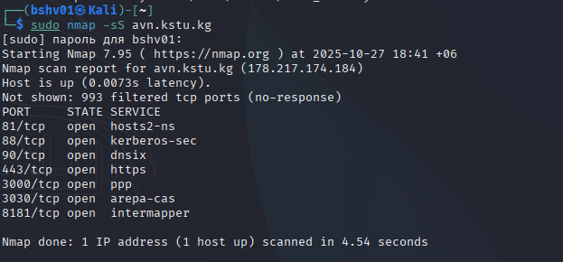
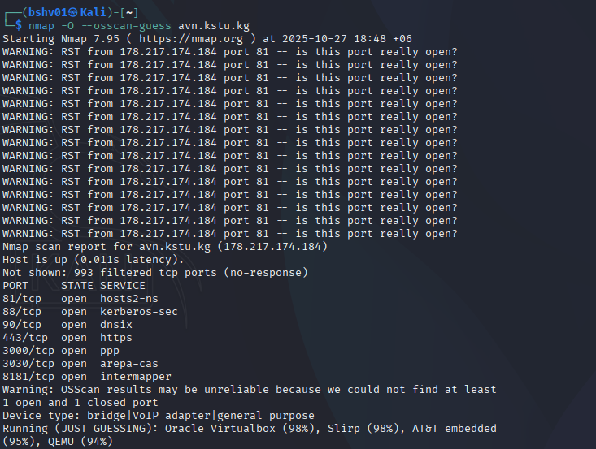
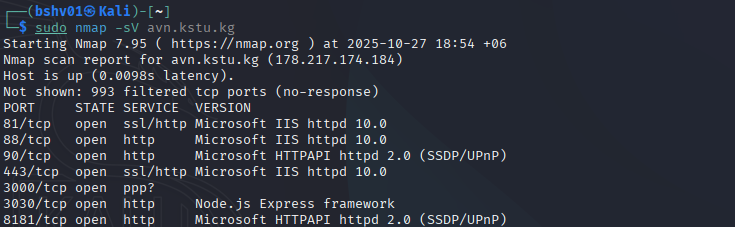
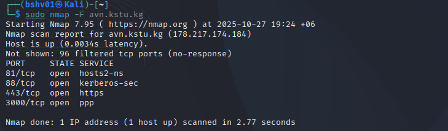
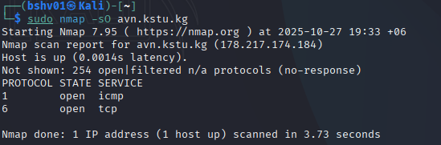
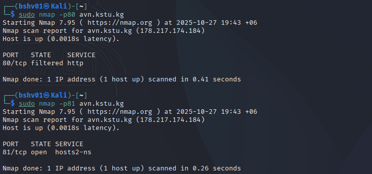
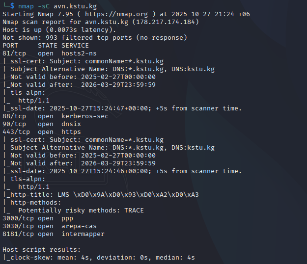
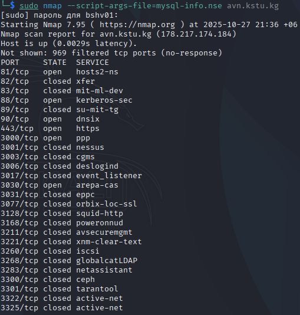
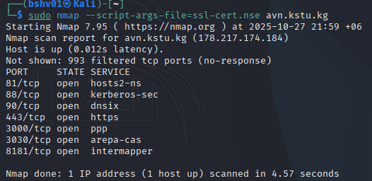

## Лабораторная работа №3

 **Задача:** В Кали линукс, через nmap собрать данные сайта, пройтись по командам и зафиксировать результаты.
 ______________________________________________

>sudo nmap -sS [адрес веб-сайта]

Это простая команда может использоваться для проверки доступен ли сайт

_______________________________________________

>sudo nmap -O --osscan-guess [адрес веб-сайта]

Эта опция даст команду nmap попробовать предположить, какая операционная система запущена на целевой системе. 

_______________________________________________

>sudo nmap -sV [адрес веб-сайта]

Эта команда позволяет пользователю проверить службы, запущенные на цели. Обратите внимание, что появился столбик VERSION — в нём указана версия программного обеспечения.

_______________________________________________

>sudo nmap -F [адрес веб-сайта]

Быстрый скан самых распространённых портов

_______________________________________________

>sudo nmap -sn [адрес веб-сайта]

Пинг сканирование – просто определить, работает ли хост

_______________________________________________

>sudo nmap -sO [адрес веб-сайта]

Сканирование IP протокола

_______________________________________________

>sudo nmap -p<порты> [адрес веб-сайта]

Сканирование только определенных портов

_______________________________________________

>nmap -sC avn.kstu.kg

Команда nmap -sC avn.kstu.kg выполняет сканирование хоста с использованием стандартных NSE-скриптов Nmap для определения открытых портов, сервисов и базовой информации о них.

Сканирование показало, что хост avn.kstu.kg доступен и имеет несколько открытых портов — 81, 88, 902, 443, 3030 и 8089, на которых работают службы HTTPS, Kerberos, PPP и другие. На портах 81 и 443 используется SSL-сертификат, действительный с 27 февраля 2025 по 29 марта 2026 года, выданный для домена *.kstu.kg. Также Nmap обнаружил потенциально рискованный HTTP-метод TRACE и отметил небольшое расхождение времени (clock skew) в среднем на 4 секунды.
_______________________________________________

>sudo nmap --script-args-file=mysql-info.nse avn.kstu.kg

Команда sudo nmap --script-args-file=mysql-info.nse avn.kstu.kg запускает Nmap с правами суперпользователя и передаёт файл аргументов для NSE-скрипта mysql-info.nse, чтобы запустить этот скрипт против хоста avn.kstu.kg при сканировании открытых портов и сервисов.

Скан показал, что хост доступен с очень низкой задержкой и имеет лишь несколько открытых сервисов (в списке заметны порты 81 — hosts2-ns, 88 — kerberos-sec, 90 — dnsix, 443 — https, 3000 — ppp и 3030 — arepa-cas), тогда как множество других портов в ответе отмечены как закрытые. Поскольку стандартный порт MySQL (3306) не отображается среди открытых, скрипт mysql-info.nse скорее всего не обнаружил работающего MySQL-сервера (или он закрыт/фильтруется брандмауэром). В результате видно, что система открыла только ограниченный набор сервисов, а большинство проверенных портов недоступны.
_______________________________________________

>sudo nmap --script-args-file=ssl-cert.nse avn.kstu.kg

Команда sudo nmap --script-args-file=ssl-cert.nse avn.kstu.kg запускает Nmap с правами суперпользователя и передаёт файл аргументов для NSE-скрипта ssl-cert.nse, чтобы при сканировании попытаться получить информацию о SSL-сертификатах на целевом хосте.

Сканирование завершилось быстро (≈4.6 с) и показало, что хост доступен с низкой задержкой; 993 порта не ответили (фильтруются). Были обнаружены открытые порты 81, 88, 90, 443, 3000, 3030 и 8181, то есть на хосте работают несколько сервисов, включая HTTPS на 443. Однако вывод не содержит сведений о сертификатах — это означает, что либо целевые сервисы не предоставили TLS/сертификат при проверке, либо скрипт не вернул данные по причине конфигурации/аргументов.