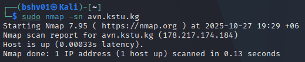

## Лабораторная работа №3

 **Задача:** В Кали линукс, через nmap собрать данные сайта, пройтись по командам и зафиксировать результаты.
 ______________________________________________

>sudo nmap -sS [адрес веб-сайта]

Это простая команда может использоваться для проверки доступен ли сайт

_______________________________________________

>sudo nmap -O --osscan-guess [адрес веб-сайта]

Эта опция даст команду nmap попробовать предположить, какая операционная система запущена на целевой системе. 

_______________________________________________

>sudo nmap -sV [адрес веб-сайта]

Эта команда позволяет пользователю проверить службы, запущенные на цели. Обратите внимание, что появился столбик VERSION — в нём указана версия программного обеспечения.

_______________________________________________

>sudo nmap -F [адрес веб-сайта]

Быстрый скан самых распространённых портов

_______________________________________________

>sudo nmap -sn [адрес веб-сайта]

Пинг сканирование – просто определить, работает ли хост

_______________________________________________

>sudo nmap -sO [адрес веб-сайта]

Сканирование IP протокола

_______________________________________________

>sudo nmap -p<порты> [адрес веб-сайта]

Сканирование только определенных портов

_______________________________________________